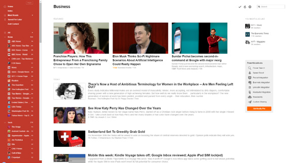
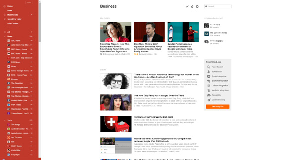

#Feedly Wide Userstyle

A userstyle for [feedly.com](http://feedly.com/) which makes it more vivid and readable. If you enjoy it please [help us make it better](https://github.com/LubomirGeorgiev/FeedlyWide/issues) and hit the star button at the top of the page. Thanks!

###With Feedly Wide

###Without Feedly Wide

##How to install
[Please read this guide](https://userstyles.org/help/stylish)

1. Install [Stylish](https://userstyles.org/)
2. Create new style and make sure it applies to `URLs on the domain : feedly.com`
3. Copy the content of [Feedly-Wide.css](Feedly-Wide.css) and paste it into the style you've just created.

 - Install on [Chrome](https://chrome.google.com/webstore/detail/stylish/fjnbnpbmkenffdnngjfgmeleoegfcffe?hl=en) 
 - Install on [Mozilla Firefox](https://addons.mozilla.org/en-US/firefox/addon/stylish/)
 
##Bugs and Improvements
Open an issue or submit a pull request. I will be delighted. :blush:
